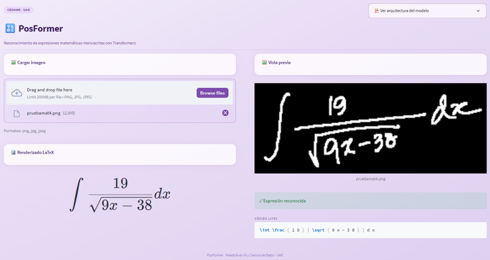

[Volver](README.md)

# Resultados 

## 1. Resultados sobre datasets de evaluación
Se evaluó el modelo sobre cinco datasets usando los pesos preentrenados provistos por los autores. La siguiente tabla compara los resultados obtenidos localmente con los reportados en el artículo original:

| Dataset | Métrica | Obtenido | Paper | Diferencia |
| :--- | :--- | :---: | :---: | :---: |
| CROHME 2014 | ExpRate | 62.74% | 62.68% | +0.06% |
| CROHME 2014 | ≤ 1 error | 79.08% | 79.01% | +0.07% |
| CROHME 2019 | ExpRate | 64.97% | 64.97% | 0.00% |
| CROHME 2019 | ≤ 1 error | 82.40% | 82.49% | -0.09% |
| MNE N1 | ExpRate | 60.59% | 60.59% | 0.00% |
| MNE N2 | ExpRate | 38.82% | 38.82% | 0.00% |
| MNE N3 | ExpRate | 34.32% | 34.08% | +0.24% |

Los resultados obtenidos localmente son prácticamente idénticos a los del paper, con diferencias menores a 0.3% en todos los casos. Estas pequeñas variaciones se deben a diferencias en el hardware y el orden de procesamiento, pero confirman que el modelo y los pesos preentrenados funcionan correctamente.

## 2. Análisis de resultados

A medida que aumenta la complejidad estructural de las expresiones, el ExpRate disminuye. En CROHME, donde las expresiones son de una sola línea, el modelo alcanza un 62.74% y 64.97% para 2014 y 2019 respectivamente. Al pasar a MNE, los resultados bajan progresivamente con el nivel de anidamiento: 60.59% en N1, 38.82% en N2 y 34.32% en N3. Esto es esperado porque las expresiones con mayor anidamiento contienen más símbolos estructurales como ^, _, \frac y \sqrt anidados entre sí, lo que representa el mayor desafío para cualquier modelo de HMER.

Lo más relevante es que la ventaja de PosFormer sobre su modelo base CoMER es mayor precisamente donde más importa. En CROHME la ganancia es de apenas +2.03%, mientras que en MNE N3 sube a +10.04%. Esto valida directamente la innovación del Position Forest, que fue diseñado para manejar expresiones anidadas complejas.

## 3. Capturas de la implementación

A continuación se muestran capturas propias de la ejecución local del modelo y de la interfaz interactiva desarrollada con Streamlit:

Captura 1: Resultados de CROHME 2014 en local.

Captura 2: Captura de Streamlit con una imagen de entrada y su resultado LaTeX renderizado.

# 7. Conclusiones

Implementar PosFormer permitió entender de forma práctica cómo el mecanismo de atención de un Transformer puede extenderse para resolver un problema tan específico como el reconocimiento de expresiones matemáticas manuscritas. Estudiar la arquitectura en detalle, especialmente la distinción entre símbolos entidad y símbolos estructurales y cómo el Position Forest aborda ese problema de forma explícita, representa una forma de pensar el diseño de modelos que va más allá de este trabajo. Los resultados obtenidos localmente confirmaron lo reportado en el artículo: la ventaja de PosFormer sobre CoMER es pequeña en expresiones simples pero crece significativamente en expresiones anidadas complejas, lo que valida directamente la innovación propuesta.

Una limitación relevante del modelo es su sensibilidad al formato de entrada. Durante las pruebas con la interfaz Streamlit encontramos que el modelo fue entrenado exclusivamente con imágenes de fondo negro y trazos blancos, por lo que imágenes con fondo claro generaban predicciones incorrectas o sin sentido. Además, expresiones con trazos poco definidos, imágenes de baja resolución o con ruido de fondo también afectan negativamente el reconocimiento. Esta limitación es inherente al dataset de entrenamiento y no a la arquitectura en sí.

Como posibles mejoras, extender la interfaz para mostrar los mapas de atención del modelo permitiría visualizar qué regiones de la imagen observa el decoder en cada paso de generación, lo que sería valioso tanto para análisis como para depuración. Respecto al dataset M2E, aunque no fue evaluado localmente debido a que requiere descargar un conjunto de entrenamiento de aproximadamente 80,000 imágenes y sus scripts de evaluación presentan incompatibilidades con Windows, los resultados reportados en el artículo original muestran un ExpRate de 58.33%, lo que complementa el panorama de evaluación del modelo. Finalmente, explorar técnicas de preprocesamiento más robustas permitiría al modelo manejar imágenes con distintos fondos y estilos de escritura sin depender de la binarización manual implementada en la interfaz.

